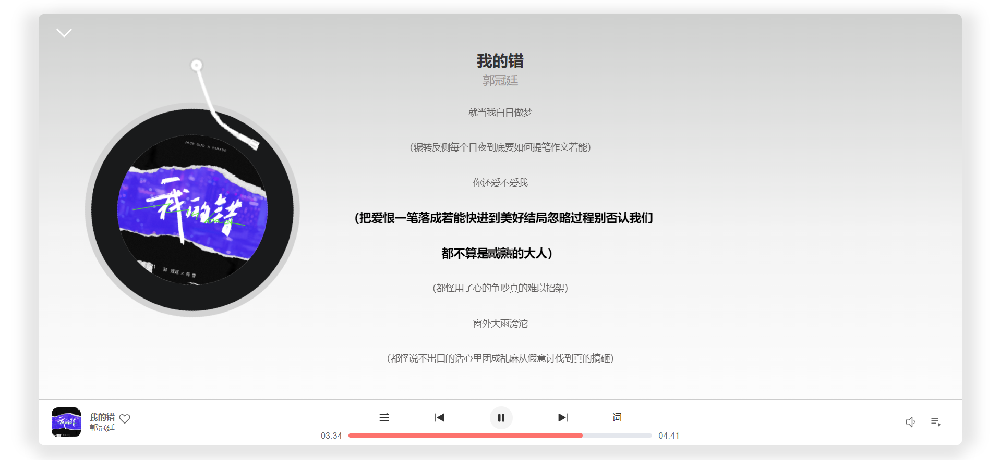

# 仿网易云音乐Web App

<br>
<p align="center">
<a href="http://adjfks.github.io/NeteaseCloudMusic-Website/" target="_blank">

</a>
</p>

<p align="center">
仿 <b>网易云音乐</b><b>Web</b>App
</p>

<p align="center">
<a href="https://github.com/adjfks/NeteaseCloudMusic-Website" target="__blank"></a>
</p>

<p align="center">
  <a href="http://net.swttws.top">在线网站</a>
</p>

<p align="center">
 <p align="center">首页展示</p>
 
 <p align="center">歌曲播放页展示</p>
 
</p>

## 技术栈
- Vue3
- Vue-Router
- Pinia
- Unocss
- Less
- TypeScript
- Vite
- VueUse
- Unplugin-auto-import
- pnpm


## 目标功能
- 个性音乐页面✅
- 歌单详情页✅
- 歌手详情页✅
- 排行榜✅
- 播放器✅
- 歌曲详情页✅
- 歌词滚动✅
- 歌词与播放器联动✅
- 上一曲下一曲✅
- 离线播放✅
- 扫码登录✅
- 音量调整✅
- 随机播放顺序播放
- 播放列表
- 手机号密码登录
- 邮箱登录
- 歌手详情页
- MV播放
- ......

## Getting Started

需要先克隆[NeteaseCloudMusicApi](https://github.com/Binaryify/NeteaseCloudMusicApi)到本地，然后进入该项目文件夹运行一下命令启动后台服务
```
node app.js
```
克隆本仓库到本地

安装依赖
```
pnpm install
```
启动开发环境
```
pnpm run dev
```

## 感谢
[NeteaseCloudMusicApi](https://github.com/Binaryify/NeteaseCloudMusicApi)提供Api接口服务
